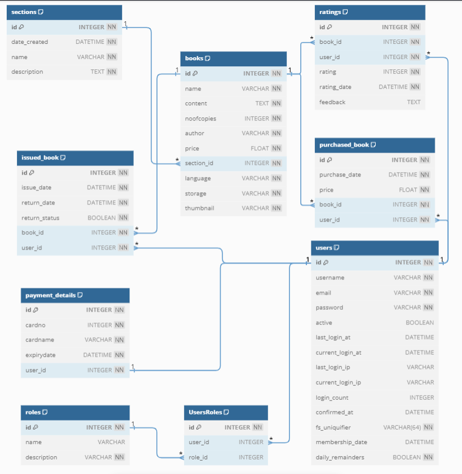

# BookLit


This is a library management system/e-library built on flask framework.

## To run the application

- Copy the repository in the local machine.

- In the terminal , type
```
pip install -r requirements.txt
```

- After installing all the dependencies, type in the terminal
```
python main.py
```
- Open a browser and type out the following url
```
http://127.0.0.1:5500/
```

## To do database migration

- In the terminal, type
```
python -m flask --app main db migrate
```

- And to upgrade, type
```
python -m flask --app main db upgrade
```

## Features 

It consists of the following featues:

- Registration of new user
- Login of admin and user
- Admin's ability to perform CRUD on sections and books.
- Admin's ability to issue/revoke book access of a user.
- Users' ability to issue and return books.
- Users' ability to purchase and download books.
- Users' ability to rate the books they have issued/purchased.
- Users' ability to delete their accounts. 
- Paid version of the app to get access to text-to-speech version of the e-books.
- Search functionality for sections, books and author.
- Random selection of a book from all the books in the library.

## Db schema design



## Technologies used
- Flask - the main web framework
- bcrypt - to encrypt the password
- zxcvbn - to check the password strength
- Flask-Security-Too - to provide secure login, registration, authentication & Role based access
- Flask-Migrate - for db migration
- Flask-SQLAlchemy - for object-relational mapping
- Flask-WTF and WTForms - for form creation and validation
- pypdf - to read the pdf files
- gtts - to convert text to speech
- Flask-Restful - to create api
- requests - to send requests to the api
- matplotlib - to create graph
- jinja2 - template engine
- html and bootstrap (for css)
- sqlite - for persistent data storage

## Files and Folders 

- `instance folder` has the sqlite database, *library.sqlite3*.
- `migrations folder` has files for database migrations. More about it is [here](https://flask-migrate.readthedocs.io/en/latest/).
- `application folder` contains the python files need by the controllers.
    + `models.py` has the ORM models of the database tables. More about it is [here](https://flask-sqlalchemy.palletsprojects.com/en/3.1.x/quickstart/).
    + `forms.py` has the flask forms used in the app.
    + `setup.py` has all the setup configurations and initializations for the app and some functions used by other parts of the app. 
- `controllers folder` has the  controllers and api of the app.
    + `Admin.py` has controllers related to the role of *Admin*.
    + `User.py` has controllers related to the role of *User*.
    + `Generic.py` has controllers that are not related to any specific role.
    + `Api.py` has APIs to generate graph and to do *CRUD* operations on books & sections.
- `static folder` contains the static files used in the app.
    + `books folder` stores the books' pdfs.
    + `sound folder` stores the books' text-to-speech sound files.
    + `thumbnail folder` stores the books' thumbnails.
    + `graph.png` for admin dashboard.
- `templates folder` contains the html templates for the app.
    + `admin folder` has templates related to the role of *Admin*.
    + `user folder` has templates related to the role of *User*.
    + `security folder` has (overridden) templates used by Flask security. More about it is [here](https://flask-security-too.readthedocs.io/en/stable/customizing.html).
    + Other templates for generic uses.
- `images folder` contains the images added to this readme file.
- `main.py` is the main python file that contains the run method of the app.
- `requirements.txt` lists out the python modules that need to be installed to run this app.


### Note :
+ The default admin login credentials are username: librarian, email: librarian@gmail.com, password: pass#word12 . This can be changed in setup.py file.
+ The text-to-speech feature of the app reads the pdf file's text. However this might not be a perfect reading due some limitions of [pdf text extraction](https://pypdf.readthedocs.io/en/stable/user/extract-text.html#why-text-extraction-is-hard).
+ Internet connection is required for the bootstrap css and js files, some background images, password breach checking while registration and also for converting the text to speech as it uses Google-Text-To-Speech(gtts) module.
